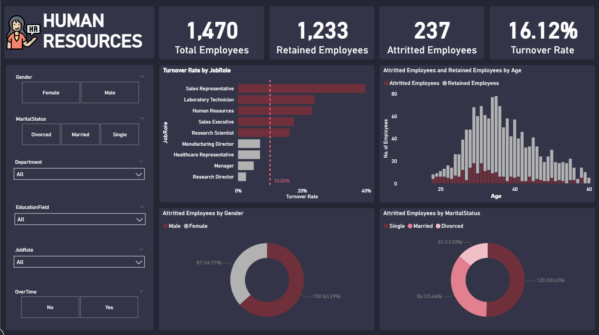

# 📊 Dự Án Phân Tích Nhân Sự & Dự Đoán Nghỉ Việc (HR Analytics)

Dự án này tập trung vào việc xử lý, trực quan hóa dữ liệu nhân sự và phân tích các yếu tố ảnh hưởng trực tiếp đến quyết định nghỉ việc (`Churn`) của 10,000 nhân viên. Hệ thống báo cáo được xây dựng toàn diện trên nền tảng **Power BI**, ứng dụng **Power Query** để chuẩn hóa dữ liệu và **DAX** để xây dựng các mô hình chỉ số đo lường (Metrics).

---

## 🛠️ Công Nghệ & Kỹ Thuật Sử Dụng

* **Công cụ chính:** Microsoft Power BI Desktop
* **Power Query (M-Code):** Khai phá dữ liệu (EDA), làm sạch headers, chuẩn hóa định dạng, xử lý dữ liệu khuyết thiếu/bị lỗi từ tệp CSV gốc.
* **Data Modeling:** Xây dựng mô hình dữ liệu tối ưu (Star Schema / Kimball) kết nối bảng dữ liệu nhân viên (`employee_info`) và bảng từ điển (`Data Dictionary`).
* **DAX (Data Analysis Expressions):** Tính toán các chỉ số nâng cao (Time Intelligence, Churn Rate %, YTD, Moving Average,...) và phân tích Metric Trees.

---

## 📁 Cấu Trúc Thư Mục Dự Án

```text
├── data/
│   ├── employee_info.csv          # Tập dữ liệu thô chứa thông tin của 10,000 nhân viên
│   └── Data Dictionary.xlsx       # Từ điển dữ liệu giải thích các trường thông tin (Anh - Việt)
├── images/
│   └── demo-dashboard.png         # Ảnh chụp màn hình báo cáo hoàn thiện trong Power BI
├── HR_Analytics_Report.pbix       # File báo cáo gốc Power BI
└── README.md                      # Tài liệu hướng dẫn và giới thiệu dự án
```

---

## 🖼️ Ảnh Demo Báo Cáo (Dashboard Preview)
Dưới đây là giao diện trực quan hóa dữ liệu báo cáo nhân sự được thiết kế trên Power BI, giúp nhà quản lý dễ dàng theo dõi các chỉ số biến động nhân sự cốt lõi:



---

## 📖 Từ Điển Dữ Liệu (Data Dictionary)

Dưới đây là các trường thông tin cốt lõi đã được đưa vào mô hình tính toán Power BI:

| Tên Cột (English) | Kiểu Dữ Liệu | Mô Tả (Tiếng Việt) |
| :--- | :--- | :--- |
| **Employee ID** | Text | Mã định danh duy nhất của nhân viên |
| **Age / Gender** | Integer / Cate | Tuổi và Giới tính (`Male`, `Female`, `Other`) |
| **Tenure** | Integer | Số năm nhân viên đã làm việc tại công ty |
| **Job Role / Department**| Categorical | Vị trí công việc và Phòng ban (`HR`, `IT`, `Marketing`, `Sales`) |
| **Salary** | Decimal | Mức lương hàng năm của nhân viên (USD) |
| **Work Location** | Categorical | Mô hình làm việc (`Remote`, `On-site`, `Hybrid`) |
| **Performance Rating** | Integer | Đánh giá hiệu suất làm việc (Thang điểm 1–5) |
| **Satisfaction Level** | Percentage | Mức độ hài lòng của nhân viên (Thang điểm 0–1) |
| **Work-Life Balance** | Categorical | Cân bằng công việc & cuộc sống (`Poor`, `Average`, `Good`, `Excellent`) |
| **Overtime Hours** | Integer | Tổng số giờ làm thêm ngoài giờ trong năm |
| **Churn** | Binary (0/1) | **Biến mục tiêu**: `1` nếu đã nghỉ việc, `0` nếu đang làm việc |

---

## 📊 Quy Trình Triển Khai Dự Án (Pipeline)

### 1. Trích xuất & ETL (Power Query)
* Kết nối dữ liệu từ tệp `employee_info.csv`.
* Xử lý hàng lỗi, loại bỏ các bản ghi trùng lặp (Duplicate) hoặc không hợp lệ.
* Định dạng lại kiểu dữ liệu (Data Type) chuẩn xác cho các cột điểm số (`Satisfaction Level` thành dạng `%`, `Salary` thành loại Tiền tệ).

### 2. Mô hình hóa dữ liệu (Data Modeling)
* Tổ chức cấu trúc bảng theo tư duy **Kimball Methodology** giúp tối ưu hóa tốc độ load và tính toán của DAX.
* Thiết lập mối quan hệ giữa các bảng chiều (Dimension) và bảng sự kiện (Fact).

### 3. Phát triển chỉ số phân tích (DAX Measures)
Hệ thống sử dụng các công thức DAX để tính toán động theo bộ lọc (Slicers):
* **Tổng số nhân viên:** `Total Employees = COUNTROWS('employee_info')`
* **Số nhân viên đã nghỉ:** `Total Churned = CALCULATE(COUNTROWS('employee_info'), 'employee_info'[Churn] = 1)`
* **Tỷ lệ nghỉ việc (% Churn Rate):** `Churn Rate % = DIVIDE([Total Churned], [Total Employees], 0)`
* **Điểm hài lòng trung bình:** `Avg Satisfaction = AVERAGE('employee_info'[Satisfaction Level])`

### 4. Trực quan hóa & Phân tích (Dashboard)
Thiết kế giao diện báo cáo (`demo-dashboard.png`) tập trung vào trải nghiệm người dùng (UX) với các cấu trúc:
* **Thẻ chỉ số (KPI Cards):** Hiển thị nhanh quy mô nhân sự, tỷ lệ nghỉ việc tổng quan (~20.28%).
* **Metric Tree (Cây chỉ số):** Phân rã tỷ lệ Churn theo từng Phòng ban (`Department`) và Vị trí (`Job Role`).
* **Phân tích tương quan (Correlation):** Sử dụng biểu đồ để tìm ra mối liên hệ giữa Số giờ làm thêm (`Overtime Hours`) và Mức độ kiệt sức dẫn đến quyết định nghỉ việc.

---

## 📈 Kết Luận Từ Dữ Liệu

Từ Dashboard Power BI, dự án chỉ ra một số insight quan trọng hỗ trợ phòng HR:
* **Yếu tố Overtime:** Nhóm nhân viên có số giờ OT cao và điểm `Work-Life Balance` ở mức *Poor* sở hữu tỷ lệ nghỉ việc vượt trội.
* **Tác động từ Quản lý:** Điểm phản hồi từ quản lý (`Manager Feedback Score`) thấp có mối tương quan thuận với xu hướng rời đi của nhân sự mới (`Tenure < 2 năm`).
